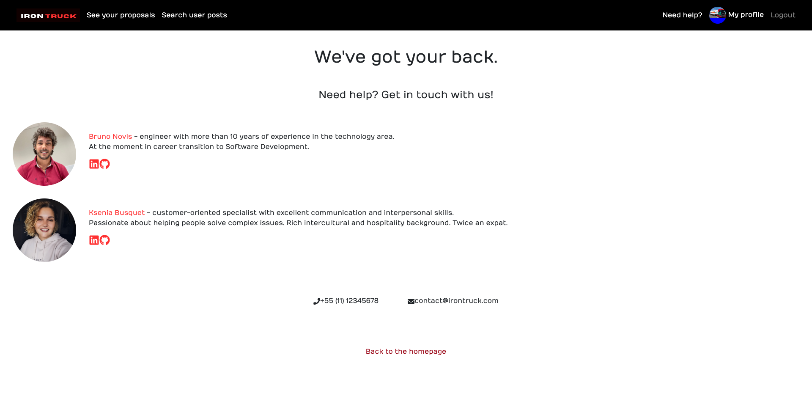

# IronTruck

This project was created as a conclusion of the final module during the Ironhack Web Development Bootcamp in August, 2022.

The main objective of the IronTruck app is to help users who want to move to another place connect with the companies availabe for this service.

## Table of Contents

- [Repo Links](#repos)
- [Tech Stack](#tech)
- [Screenshots](#screenshots)
- [Project Status](#project-status)
- [Project presentation](#project-presentation)
- [About Us](#about-us)

## Repo Links

Front-End: [Click here](https://github.com/Bru9is/irontruck-client)

Back-End: [Click here](https://github.com/Bru9is/irontruck-server)

Deployed site: [Click here](https://irontruck.netlify.app)

## Tech Stack

HTML, CSS, JavaScript, React.js, Express.js, Node.js, MongoDB

## Screenshots

## Project Status

_finished_

## Project Presentation

The project was delivered on September, 2nd, 2022 in form of presentation to the Lead Teacher [Nilton de Freitas](https://github.com/oniltos) and Teacher Assistant [Felipe Osório](https://github.com/Briofita09).

[Click here](https://www.canva.com/design/DAFE1KYLYmo/dDpO1ziTEOrpigZZsktJ8Q/edit?utm_content=DAFE1KYLYmo&utm_campaign=designshare&utm_medium=link2&utm_source=sharebutton) to watch the project presentation!

## 🚀 About Us

- [Bruno Novis](https://www.github.com/bru9is) - engineer with more than 10 years of experience in the technology area. At the moment in career transition to Software Development.
- [Ksenia Busquet](https://www.github.com/kseniabusquet) - Talent Acquisition Associate and customer-oriented specialist with excellent communication and interpersonal skills. Passionate about helping people solve complex issues. Currently transitioning into Software Development. Twice an expat.
